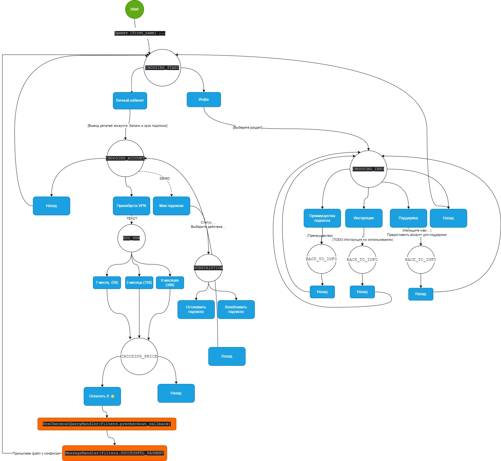
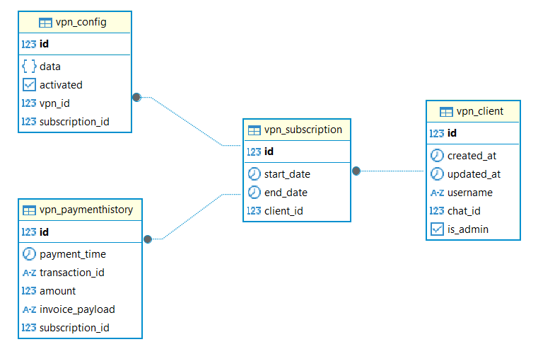

# vnp-bot
Telegram bot intended to sell vpn subscriptions for telegram users using telegram stars

The project is divided for two parts: 
- Django part (Django ORM + admin site)
- Telegram bot part (PTB + VPN service + Business logic)

## Bot structure


## ERD diagram


# How to run

## Quickstart

Create `.env` file in root directory and copy-paste from `.env_example`,
don't forget to change telegram token.

Run docker-compose.yaml
``` bash
docker-compose up -d --build
```

